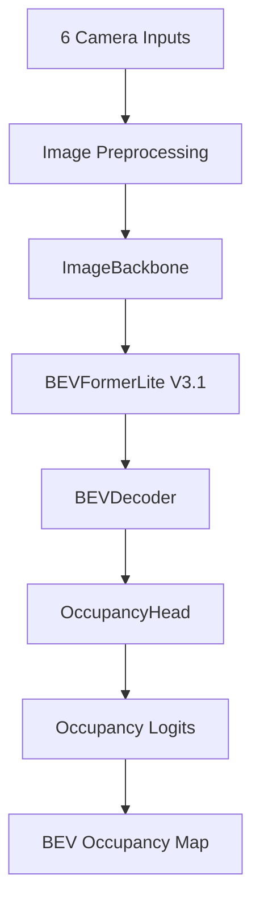

# BEV-NET: Multi-Camera Bird's-Eye View Occupancy Prediction

## Project Overview

BEV-NET is an end-to-end computer vision system for predicting a 2D Bird's-Eye View occupancy map from 6 surround-view RGB cameras. It is designed for autonomous driving perception, where the model converts synchronized camera images into a top-down occupancy representation of the nearby environment. The project includes data preprocessing, geometry handling, multi-camera BEV transformation, occupancy prediction, evaluation, and a FastAPI-based demo interface.  

The system is built on a custom **BEVOccupancyModel** pipeline consisting of an **ImageBackbone**, **BEVFormerLite V3.1**, **BEVDecoder**, and **OccupancyHead**. The final model predicts a `200 x 200` occupancy grid and supports both dataset-based inference and fixed-calibration custom upload inference.  

---

## Model Architecture

The model takes 6 camera images along with camera intrinsics and extrinsics as input. The images are first passed through a shared image backbone to extract visual features. These features are then transformed into Bird's-Eye View space using **BEVFormerLite V3.1**, which performs geometry-aware BEV feature sampling across multiple height levels. The BEV representation is then refined using a **BEVDecoder**, and the final occupancy prediction is produced using an **OccupancyHead**.  

### Architecture Pipeline
- **Input**: `B x 6 x 3 x H x W` RGB camera images  
- **ImageBackbone**: shared feature encoder for all six cameras  
- **BEVFormerLite V3.1**: projects image features into BEV space  
- **BEVDecoder**: spatial BEV refinement  
- **OccupancyHead**: generates main occupancy logits and auxiliary logits  
- **Output**: `B x 1 x 200 x 200` occupancy prediction  

### Mermaid Diagram


---

## Dataset Used

This project uses the **nuScenes mini** dataset. The dataset contains multi-camera driving scenes and was used to prepare inputs such as camera images, intrinsic matrices, extrinsic matrices, and BEV occupancy targets.  

The final split used in this project was:
- **Total samples**: 404  
- **Training samples**: 323  
- **Validation samples**: 81  

The BEV grid resolution is `200 x 200`, covering the configured BEV space using a `0.4 m` cell size.  

---

## Setup and Installation Instructions

### 1. Clone the repository
```bash
git clone <your-repo-url>
cd <your-project-folder>
```

### 2. Install dependencies
```bash
pip install -r requirements.txt
```

### 3. Prepare the dataset
- Download the **nuScenes mini** dataset.
- Place it inside the configured dataset directory.
- Update the dataset path in your configuration file if needed.

### 4. Run the FastAPI application
```bash
uvicorn main:app --reload
```

### 5. Open the demo
After launching the server, open the local FastAPI URL shown in the terminal. You can then:
- browse validation scenes,
- choose featured scenarios,
- or upload 6 custom camera images for inference.

---

## How to Run the Code

### Training
The project was trained using:
- **Optimizer**: AdamW  
- **Learning rate**: `2e-4`  
- **Weight decay**: `1e-4`  
- **Epochs**: 60  
- **Scheduler**: Cosine Annealing  
- **Gradient clipping**: enabled  

### Training Phases
- **Warmup (Epochs 1–5)**: focal loss + dice loss + auxiliary BCE  
- **Phase 1 (Epochs 6–40)**: adds DWE, confidence regularization, and TV regularization  
- **Phase 2 (Epochs 41–60)**: stronger DWE-focused weighting  

### Inference
The application supports three modes:
- **Dataset browser mode**
- **Featured scene mode**
- **Custom upload mode**

The inference flow is:
1. Load images and calibration
2. Run forward pass through the model
3. Apply sigmoid to logits
4. Threshold probabilities into a binary occupancy map
5. Compute metrics and visualize the outputs

---

## Example Outputs / Results

The project generates qualitative and quantitative outputs for validation analysis. Saved examples include:
- **Best validation samples**
- **Worst validation samples**
- **Random validation samples**
- **Training curves**
- **Metric distributions**
- **V2 vs V3 comparison charts**

### Final V3 Evaluation
- **IoU**: `0.3649`
- **Corrected DWE**: `0.1137`
- **Precision**: `0.4520`
- **Recall**: `0.6110`
- **F1 Score**: `0.5146`
- **IoU Near Ego**: `0.6278`
- **IoU Far Field**: `0.3150`

### Sample Output Placeholders
```md


```

---

## Results and Model Comparison

To clearly show project progress, this README includes a comparison between the previous baseline model and the latest model. This is useful for evaluators because it shows both performance improvement and evidence of iteration.

### Quantitative Comparison

| Model | IoU | DWE | Precision | Recall | F1 |
|---|---:|---:|---:|---:|---:|
| V2 Baseline | 0.3011 | 0.2323 | 0.4369 | 0.5218 | 0.4734 |
| V3 Final | 0.3649 | 0.1137 | 0.4520 | 0.6110 | 0.5146 |

### Improvement Over V2
- **IoU improvement**: `+0.0638`
- **DWE reduction**: `-0.1186`
- **IoU improvement percentage**: `21.2%`
- **DWE improvement percentage**: `51.1%`

### Why This Comparison Matters
This section demonstrates that the final model is not just a single output, but the result of iterative experimentation and measurable improvement. Including previous model outputs next to the latest outputs makes the README much stronger during evaluation.

### Suggested Visual Comparison Section
You can add a side-by-side image grid like this:
```md
| Ground Truth | V2 Prediction | V3 Prediction |
|---|---|---|
|  |  |  |
```

---

## Demo Interface

The project also includes a FastAPI-based frontend for interactive inference and visualization. The interface supports:
- scene browser,
- featured scenario selection,
- custom image upload,
- threshold slider,
- probability heatmap,
- binary occupancy map,
- error legend,
- and live metric updates.

### Main API Endpoints
- `/api/samples`
- `/api/sample-preview/{index}`
- `/api/predict-sample/{index}`
- `/api/predict-upload`

---

## Project Structure

```bash
.
├── data/
├── models/
├── scripts/
├── utils/
├── static/
├── templates/
├── main.py
├── requirements.txt
└── README.md
```

---

## Conclusion

BEV-NET is a complete BEV occupancy prediction pipeline built using multi-camera inputs, geometry-aware BEV transformation, and deep learning-based occupancy estimation. The final V3 model improves significantly over the earlier baseline and provides both strong quantitative metrics and qualitative visual outputs for evaluation.